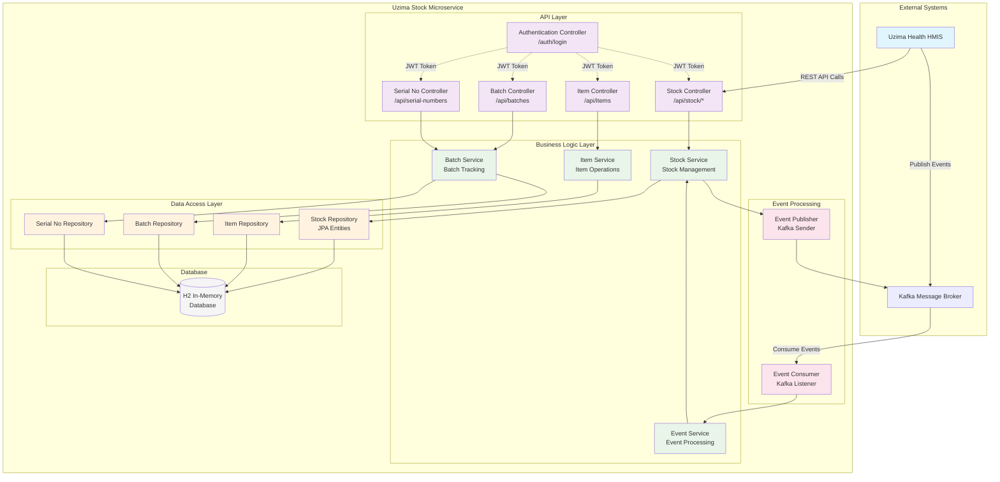

# Uzima Stock - Advanced Inventory Management

A comprehensive inventory management system built with Spring Boot, with event-driven integration to the Uzima Health HMIS system.

## 🏗️ System Architecture & Flow



### Data Flow Description:
1. **API Requests**: Clients authenticate via `/auth/login` and access inventory APIs
2. **Event Consumption**: Kafka events trigger automatic stock updates
3. **Business Processing**: Services handle inventory logic and validation
4. **Data Persistence**: JPA repositories manage database operations
5. **Event Publishing**: Stock changes trigger outbound events for other services

## 📦 Microservice Architecture

Uzima Stock is a dedicated inventory management microservice that provides:

- **Complete ERP-style inventory management**
- **Event-driven communication** with Uzima Health HMIS
- **Real-time stock tracking** with batch and serial number management
- **Procurement workflow** from material requests to goods receipt
- **Multi-warehouse support** with stock transfers

## 🔄 Event-Driven Integration

The service communicates with Uzima Health through Kafka events:

### Consumes Events:
- **PRESCRIPTION_DISPENSED**: Automatically deducts stock when medications are dispensed
- **STOCK_ADJUSTMENT**: Processes manual stock adjustments

### Publishes Events:
- **LOW_STOCK_ALERT**: Notifies when items reach reorder levels
- **EXPIRY_ALERT**: Warns about expiring stock
- **STOCK_MOVEMENT**: Reports all stock transactions

## 📊 ERP-Style Doctypes

### Core Inventory Entities:
- **Item**: Product catalog with hierarchical item groups
- **Warehouse**: Storage locations with multi-level organization
- **Stock Ledger Entry**: Complete transaction history
- **Batch**: Batch tracking with expiry management
- **Serial No**: Individual item tracking
- **UOM**: Units of measure management

### Transaction Doctypes:
- **Stock Entry**: Stock adjustments and transfers
- **Delivery Note**: Outbound shipments
- **Purchase Receipt**: Inbound goods receipt
- **Material Request**: Procurement requests

### Audit & Reconciliation:
- **Stock Reconciliation**: Periodic stock counts
- **Stock Ledger**: Comprehensive transaction log

## ✨ Key Features

### Item Management
- **Hierarchical Item Groups**: Organized product categorization
- **Multi-UOM Support**: Different units for purchasing and selling
- **Variant Management**: Product variants and attributes
- **Batch & Expiry Tracking**: Full traceability with expiry alerts

### Warehouse Management
- **Multi-Warehouse**: Separate storage locations
- **Stock Transfers**: Movement between warehouses
- **Warehouse Hierarchy**: Parent-child warehouse relationships

### Procurement Workflow
1. **Material Request** → 2. **Purchase Order** → 3. **Purchase Receipt** → 4. **Stock Update**

### Stock Tracking
- **Real-time Inventory**: Live stock levels across all warehouses
- **FIFO/LIFO**: Configurable stock valuation methods
- **Automatic Alerts**: Low stock and expiry notifications
- **Stock Ageing**: Reports on stock holding periods

### Reporting & Analytics
- **Stock Valuation**: Current and historical stock values
- **Movement Analysis**: Stock in/out patterns
- **ABC Analysis**: Product classification by value/volume
- **Expiry Reports**: Items expiring within timeframes

## Prerequisites

- Java 17 or higher
- Maven 3.6 or higher
- Kafka (for event messaging)

## How to Run

### 1. Start Kafka
```bash
# Using Docker
docker run -d --name kafka -p 9092:9092 -e KAFKA_ZOOKEEPER_CONNECT=localhost:2181 -e KAFKA_ADVERTISED_LISTENERS=PLAINTEXT://localhost:9092 -e KAFKA_OFFSETS_TOPIC_REPLICATION_FACTOR=1 confluentinc/cp-kafka:latest
```

### 2. Start Uzima Stock Service
```bash
cd /Users/user/Documents/spring-boot/uzima-stock
mvn spring-boot:run
```

### 3. Access the Application
- **API Base URL**: `http://localhost:8080`
- **H2 Database Console**: `http://localhost:8080/h2-console`
  - JDBC URL: `jdbc:h2:mem:uzimastock`
  - Username: `sa`
  - Password: `password`

## API Endpoints

### Authentication
- `POST /auth/login` - Login and receive JWT token

### Item Management
- `GET /api/items` - Get all items
- `GET /api/items/{itemCode}` - Get item by code
- `POST /api/items` - Create new item
- `PUT /api/items/{itemCode}` - Update item
- `DELETE /api/items/{itemCode}` - Delete item
- `GET /api/items/groups` - Get all item groups
- `POST /api/items/groups` - Create new item group
- `GET /api/items/uoms` - Get all units of measure
- `POST /api/items/uoms` - Create new unit of measure

### Batch & Serial Number Management
- `GET /api/batches` - Get all batches
- `GET /api/batches/{batchId}` - Get batch by ID
- `POST /api/batches` - Create new batch
- `GET /api/batches/item/{itemCode}` - Get batches by item
- `GET /api/batches/serials` - Get all serial numbers
- `GET /api/batches/serials/{serialNo}` - Get serial number by ID
- `POST /api/batches/serials` - Create new serial number

### Warehouse Management
- `GET /api/stock/warehouses` - Get all warehouses
- `GET /api/stock/warehouses/{id}` - Get warehouse by ID
- `POST /api/stock/warehouses` - Create new warehouse
- `PUT /api/stock/warehouses/{id}` - Update warehouse
- `DELETE /api/stock/warehouses/{id}` - Delete warehouse

### Stock Management
- `GET /api/stock` - Get all stock entries
- `GET /api/stock/items/{itemCode}/stock` - Get stock levels for item
- `GET /api/stock/warehouses/{id}/stock` - Get all stock in warehouse
- `GET /api/stock/ledger` - Get stock ledger entries
- `POST /api/stock-entries` - Create stock entry
- `POST /api/stock-reconciliations` - Create stock reconciliation
- `POST /api/stock-reservations` - Create stock reservation
- `POST /api/opening-stocks` - Create opening stock

### Procurement
- `GET /api/stock/material-requests` - Get material requests
- `POST /api/stock/material-requests` - Create material request
- `GET /api/stock/purchase-receipts` - Get purchase receipts
- `POST /api/stock/purchase-receipts` - Create purchase receipt

## Sample Data

On startup, the application loads comprehensive sample data:

### Items & Groups:
- **Item Groups**: Drugs, Antibiotics
- **Items**: Paracetamol 500mg, Amoxicillin 500mg
- **Specifications**: UOM, valuation rates, batch tracking

### Warehouses:
- **Pharmacy Store**: Main dispensing location
- **Main Store**: Central warehouse

### Stock Data:
- **Initial Stock**: Sample quantities with batch numbers
- **Transactions**: Stock entries and ledger records
- **Procurement**: Sample material requests and receipts

## Event Processing

### Incoming Events (from Uzima Health):
```json
{
  "eventType": "PRESCRIPTION_DISPENSED",
  "prescriptionNo": "PRESC123",
  "itemCode": "ITM001",
  "itemName": "Paracetamol 500mg",
  "quantity": 10,
  "warehouse": "Pharmacy Store",
  "user": "pharmacist"
}
```

### Automatic Processing:
1. **Stock Validation**: Check available quantity
2. **Ledger Entry**: Create stock ledger record
3. **Stock Update**: Deduct from warehouse stock
4. **Alert Generation**: Trigger low stock alerts if needed

## Security

All endpoints except `/auth/**` require authentication. Include the JWT token in the Authorization header as `Bearer <token>`.

## Project Structure

```
src/main/java/com/uzimahealth/
├── UzimaStockApplication.java
├── config/DataLoader.java
├── controller/
│   ├── masters/
│   │   ├── items/
│   │   │   ├── ItemController.java
│   │   │   ├── ItemAlternativeController.java
│   │   │   ├── ItemAttributeController.java
│   │   │   └── ItemVariantController.java
│   │   ├── itemgroups/
│   │   │   └── ItemGroupController.java
│   │   ├── uoms/
│   │   │   └── UOMController.java
│   │   ├── BatchController.java
│   │   ├── BrandController.java
│   │   ├── InventoryDimensionController.java
│   │   ├── ManufacturerController.java
│   │   ├── ProductBundleController.java
│   │   └── WarehouseController.java
│   ├── transactions/
│   │   ├── stock/
│   │   │   ├── StockController.java
│   │   │   ├── StockEntryController.java
│   │   │   ├── StockReconciliationController.java
│   │   │   ├── StockReservationController.java
│   │   │   └── OpeningStockController.java
│   │   ├── procurement/
│   │   │   ├── MaterialRequestController.java
│   │   │   └── PurchaseReceiptController.java
│   │   └── shipping/
│   │       ├── DeliveryNoteController.java
│   │       └── PackingSlipController.java
│   ├── quality/
│   │   ├── QualityInspectionController.java
│   │   └── QualityCheckController.java
│   └── reports/
│       ├── StockReportController.java
│       └── InventoryReportController.java
├── model/ (JPA entities)
├── repository/ (JPA repositories)
├── security/
│   ├── JwtUtil.java
│   ├── JwtRequestFilter.java
│   └── SecurityConfig.java
└── service/
    ├── StockEventService.java
    ├── StockEventConsumer.java
    ├── StockEventPublisher.java
    └── ... (Stock services)
```

## Technologies Used

- **Spring Boot 3.2.0**: Microservice framework
- **Spring Security**: Authentication with JWT
- **Spring Data JPA**: Data persistence
- **Spring Cloud Stream**: Event-driven messaging
- **Kafka**: Message broker for event streaming
- **H2 Database**: In-memory database
- **Maven**: Build management
- **Java 17**: Programming language

## Integration with Uzima Health

### Synchronous Calls:
- **Item Lookup**: Health service queries stock service for item details
- **Stock Check**: Real-time availability verification

### Asynchronous Events:
- **Prescription Dispensing**: Automatic stock deduction
- **Stock Alerts**: Real-time notifications
- **Inventory Updates**: Live stock level synchronization

## Future Enhancements

- Advanced analytics dashboard
- Mobile inventory management app
- Barcode/QR code integration
- IoT sensor integration for automated stock counting
- Machine learning for demand forecasting
- Multi-tenant architecture for multiple facilities